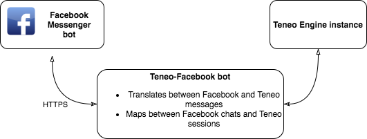

# TIE API Facebook Messenger Example

## Overview

*Graph made with [draw.io](https://draw.io)*

## Prerequisites

* Server with a running Teneo Engine instance
* Server for the Teneo-Facebook bot
  * HTTPS enabled (Facebook requires it)
  * Needs to be able to communicate with the server running the Teneo Engine instance
  * Strategy for mapping Facebook recipient to Teneo Engine session id (Redis is used in this example)
* A Facebook page to which to connect the Teneo-Facebook bot
* Facebook Developer account
  * Register the Teneo-Facebook bot web hook
  * Generate a verify token for the Facebook page

## Creating a Teneo integrated Facebook bot

### Setting up a Node.js server

This repository contains a working example in [server.js](server.js).

In this example we are using [express](https://expressjs.com) to create a simple Node.js server.

The server needs to do be able to do two things:

1. Verify the endpoint.
1. Receive a message from Facebook and send a reply from a Teneo Instance  to Facebook

In the example this is represented by the **[facebookWebhook](server.js#50-58)** function.

#### Verifying the Teneo Facebook bot endpoint

When registering the webhook for your page on the Facebook Messenger Platform, Facebook will send a `GET` request to the specified endpoint with the parameters `hub.verify_token` and `hub.challenge`. The endpoint should respond to the `GET` request with the value of `hub.challenge` iff the `hub.verify_token` matches the verify token generated for the Facebook page (see [the Prerequisites section](#prerequisites)).

See the **[verifyEndpoint](server.js#60-66)** function for reference.

#### Handling Facebook messages

Once the endpoint has been verified Facebook will proceed to send `POST` requests with messages to the specified endpoint.

When the endpoint receives a `POST` request it should do the following:

1. [Respond with `200 OK` as soon as the request comes in](server.js#70) (Facebook will wait for a 200 response before sending any additional messages)
1. For every `message` in every `entry`:
    1. [Retrieve the corresponding Teneo `sessionId` for the message sender (if any)](server.js#77)
    1. [Send the `message` text together with the `sessionId` to the Teneo instance](server.js#78-80)
    1. Await the response from the Teneo instance
    1. [Map the response to a valid Facebook message](server.js#96-101)
    1. [Send the new message to Facebook](server.js#103-121)

See the **[handleFacebookMessage](server.js#68-94)** function for reference.

#### Maintaining the Teneo Engine session

In order for the Teneo Engine to maintain the correct session a session id needs to  be sent to the instance for any given message sender. The Facebook sender to Teneo session mapping can be done in multiple ways. In the current example [Redis](https://redis.io) is used to keep track of the sender and session ids.

See the **[SessionHandler](server.js#28-44)** function for reference.

## Related projects

* [TIE API Client JS][tie-api-client-js]

[tie-api-client-js]: ../../tie-api-client-js
